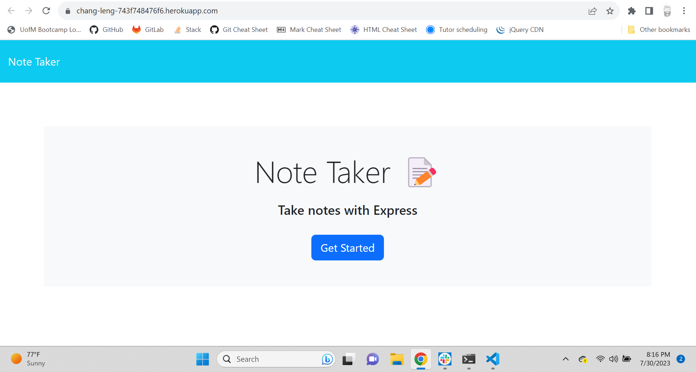
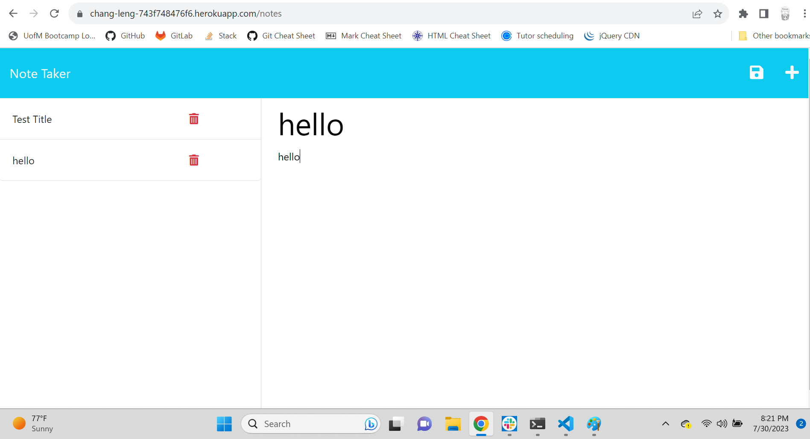

# notetaker

A great way to keep track of notes and tasks in an orderly fashion.

## Description

An application that allows, the user, to quickly access and take down notes for future referencing.

## Usage

Upon opening the application, as the user, you can click on 'Get Started' which will take you to the main screen where you can take simple, quick, and easy notes.

## Credit

N/A

## License

N/A